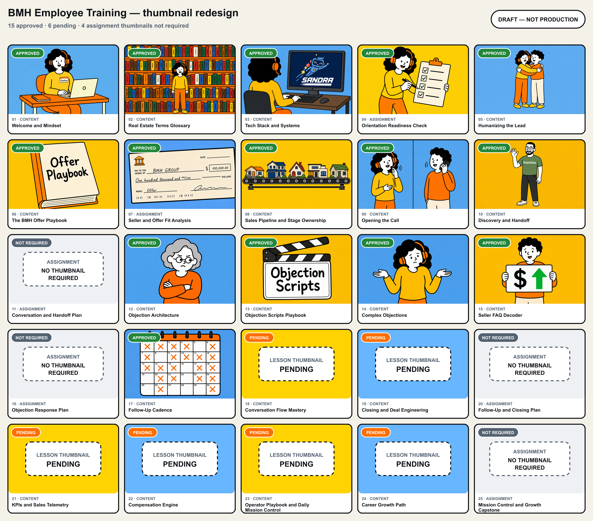

# BMH Employee Training thumbnail redesign



This is the approved review and production-promotion package from the 2026-07-20 thumbnail session.

- 21 concepts were approved as their exact 1280 x 800 PNG review files.
- 19 content concepts are promoted as display-optimized 1280 x 800 WebP lesson thumbnails (quality 90, 1.23 MB total).
- The 2 approved assignment concepts remain review references because assignments do not bind thumbnails in the manifest.
- The other 4 assignment cards are marked `NO THUMBNAIL REQUIRED`.
- The review sequence matches the 25 learner-facing content and assignment cards.
- The original July 20 promotion left the 29 video posters unchanged. That scope was corrected on July 21: every pre-play poster now uses a deterministic 16:9 crop of its matching approved lesson thumbnail, with distinct crops for multi-part lessons.

The machine-readable mapping is in [`review-index.json`](review-index.json). Checksums and dimensions are recorded in [`review-evidence.json`](review-evidence.json). The exact preapproval surface remains under [`approvals/`](approvals/), and Jarrad's response is bound to all 19 production PNGs in [`thumbnail-redesign-approval-2026-07-20.json`](approvals/thumbnail-redesign-approval-2026-07-20.json).

The production workflow:

```bash
npm run artwork:redesign-review
npm run artwork:redesign:verify
npm run artwork:production -- verify
```

Each replaced WebP is checksum-addressed in the course manifest. The exact approved PNG remains the source-of-truth evidence, the display derivative recipe is recorded in the production ledger, and prior production bytes are retained under `course-assets/thumbnails/redesign-history/` for exact rollback.

The video-poster correction is recorded in [`approvals/video-poster-redesign-approval-2026-07-21.json`](approvals/video-poster-redesign-approval-2026-07-21.json). Prior poster bytes are retained under `course-assets/posters/redesign-history/` for exact rollback.

Superseded remote posters are preserved because Supabase Storage does not provide a conditional delete tied to the object version that was verified. Exact reconciliation permits only the checksum-bound rollback paths derived from this approval and only after the matching database replacement audit exists; if a retained object is present, its exact size, metadata checksum, and bytes must still verify. The same bytes remain tracked under `course-assets/posters/redesign-history/` for rollback.
